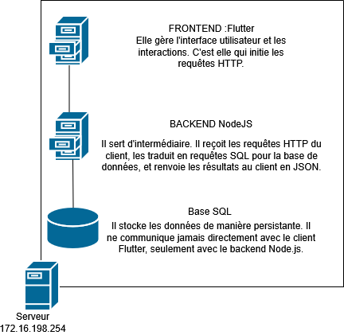
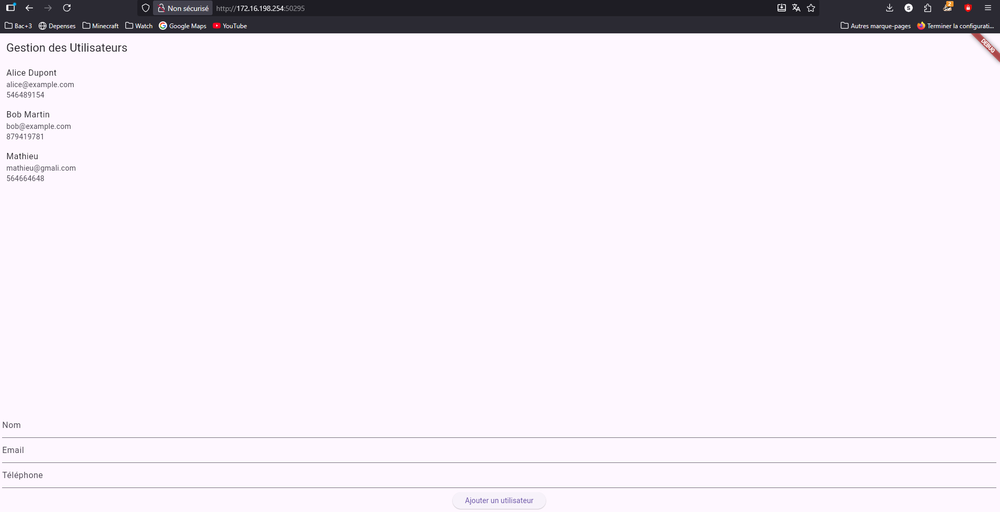
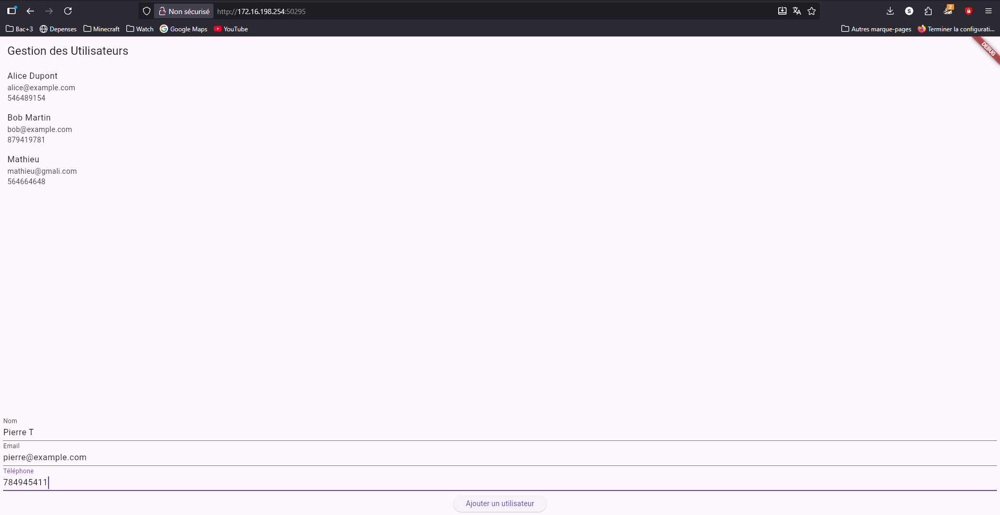
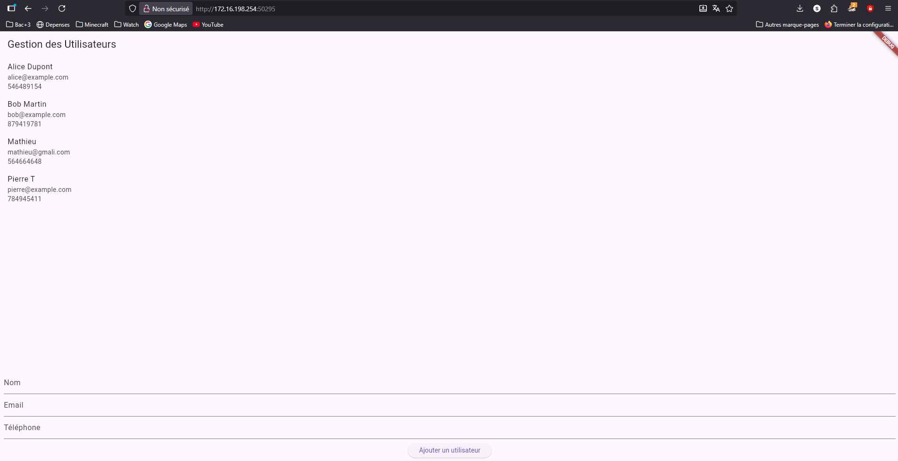
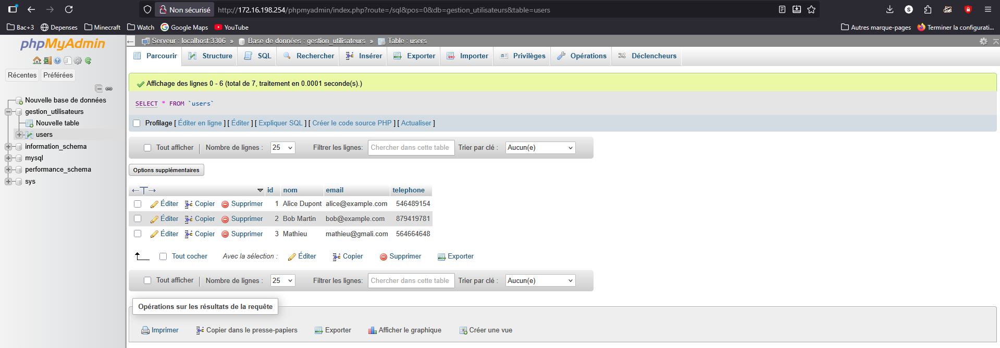

# Rapport TP Flutter OpenStreet Map

### Morin Mathieu - BTS SIO - Tessonneau Pierre

# 1. Introduction

Ce rapport documente les étapes suivies pour la création d'une application Flutter capable de communiquer avec une base de données et un serveur BACKEND. L'objectif principal était de développer une application full-stack simple, comprenant :

    Un backend en Node.js pour gérer les interactions avec MySQL.

    Une application Flutter pour l'interface utilisateur, consommant l'API créée.

    L'affichage et l'ajout de données de manière dynamique.

# 2. Suivi des étapes

Le projet a été divisé en deux parties principales : la préparation du backend et le développement de l'application frontend.

## Étape 1 : Préparation du Backend (Node.js)

    Initialisation du Projet :

        Un projet Node.js a été initialisé (npm init -y) dans un dossier BACKEND.

Les dépendances nécessaires ont été installées : express, mysql, body-parser et cors.

Configuration de la Base de Données :

    Une base de données gestion_utilisateurs a été créée.

Une table users a été définie avec les colonnes `id (AUTO_INCREMENT, PRIMARY KEY)`, `nom (VARCHAR)` et `email (VARCHAR)`.

Des données initiales (Alice Dupont, Bob Martin) ont été insérées.

Développement de l'API (server.js) :

    Un serveur Express a été configuré pour écouter sur le port 3000.

La connexion à la base MySQL gestion_utilisateurs a été établie .

Le middleware `cors()` a été utilisé pour autoriser les requêtes cross-origine.

Deux endpoints ont été créés :

    GET /api/utilisateurs : Récupère tous les utilisateurs de la table users.

POST /api/utilisateurs : Ajoute un nouvel utilisateur (nom, email) dans la table users en utilisant les données du corps de la requête (req.body).

## Étape 2 : Création de l'Application Flutter

    Initialisation du Projet :

        Un nouveau projet Flutter gestion_utilisateurs a été créé.

Le package http a été ajouté aux dépendances `pubspec.yaml`.

Configuration du Service API (api_service.dart)

La baseUrl a été définie sur l'adresse du backend (ex: http://[IP_VM]:3000/api).

Les fonctions `fetchUtilisateurs()` (utilisant http.get) et `addUtilisateur()` (utilisant http.post) ont été complétées pour interagir avec les endpoints du backend.

Construction de l'Interface (main.dart) :

    L'interface utilisateur a été construite autour d'un StatefulWidget (GestionUtilisateurs).

Un FutureBuilder a été utilisé pour gérer l'état de la récupération des données (chargement, erreur, succès).

Les utilisateurs sont affichés dans une ListView.builder, chaque utilisateur étant un ListTile affichant le nom et l'email.

Deux TextField (avec `_nomController` et `_emailController`) permettent de saisir les informations du nouvel utilisateur.

Un ElevatedButton ("Ajouter un utilisateur") déclenche la fonction `_addUtilisateur`.

La fonction `_addUtilisateur` appelle apiService.addUtilisateur puis rafraîchit la liste en appelant setState pour ré-exécuter `apiService.fetchUtilisateurs`.

# 3. Modifications Effectuées

Comme demandé dans la section "Evolution de l'application" , des modifications ont été effectuées pour gérer le numéro de téléphone des utilisateurs.

Backend (Base de données et server.js) :

### MySQL : 

La structure de la table users a été modifiée pour inclure un champ telephone.  
``` SQL
ALTER TABLE users ADD telephone INT(10);
```

### server.js : Le `INSERT` du endpoint POST a été mis à jour pour inclure le champ telephone 
``` SQL
INSERT INTO users (nom, email, telephone) VALUES (?, ?, ?).
```
Le `SELECT` du endpoint GET a été vérifié pour qu'il retourne bien le nouveau champ.

### Frontend (Application Flutter) :

**main.dart** : Un troisième `TextField` a été ajouté pour le téléphone, avec un TextEditingController associé (`_telephoneController`).

La fonction `_addUtilisateur` a été mise à jour pour récupérer le .text de ce nouveau contrôleur et le passer à apiService.addUtilisateur.

Le ListTile a été modifié pour afficher le numéro de téléphone en l'ajoutant au subtitle.

**api_service.dart** : La fonction addUtilisateur a été modifiée pour accepter un troisième paramètre telephone et l'inclure dans le corps de la requête POST.

# 4. Schéma d'Architecture



# 5. Copies d'écran









# 6. Conclusion

Ce TP a permis de mettre en œuvre une chaîne complète de développement, de la base de données à l'interface utilisateur. 
Les objectifs ont été atteints : le backend Node.js expose fonctionnellement les données mariaDB , et l'application Flutter s'y connecte pour afficher et manipuler ces données.
Les critères d'évaluation concernant la fonctionnalité des endpoints , l'affichage des données et la gestion des états (chargement, erreurs) ont été respectés.